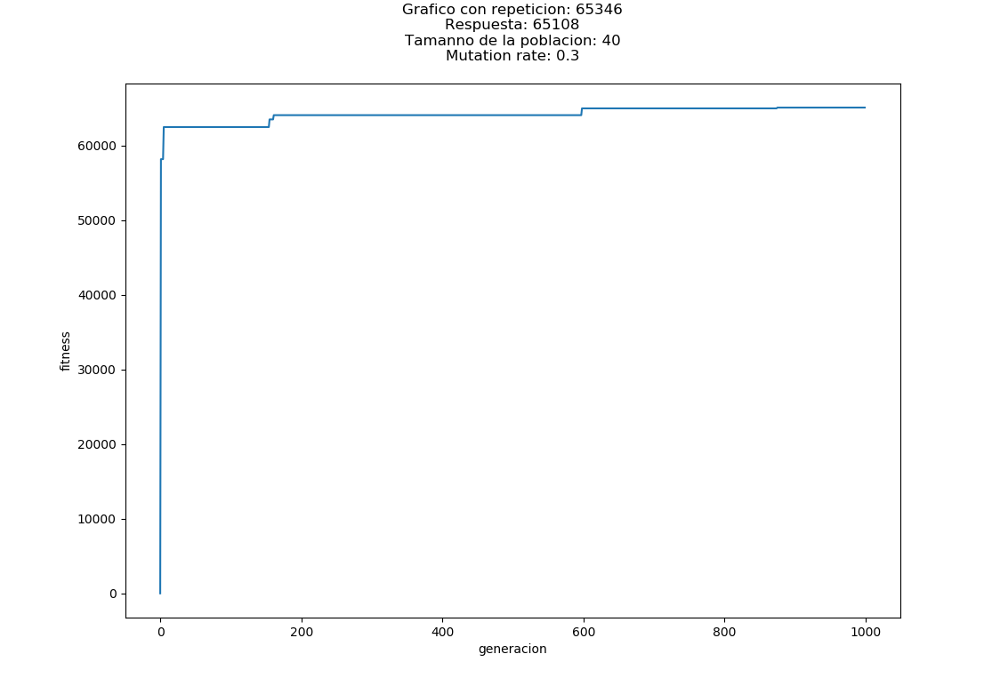
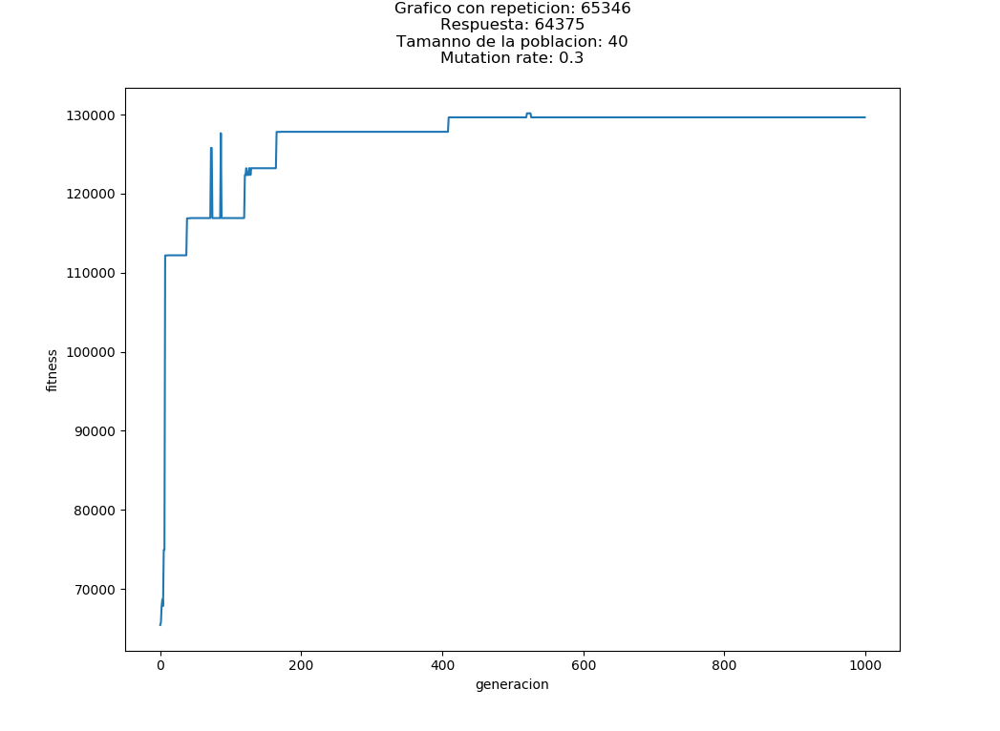
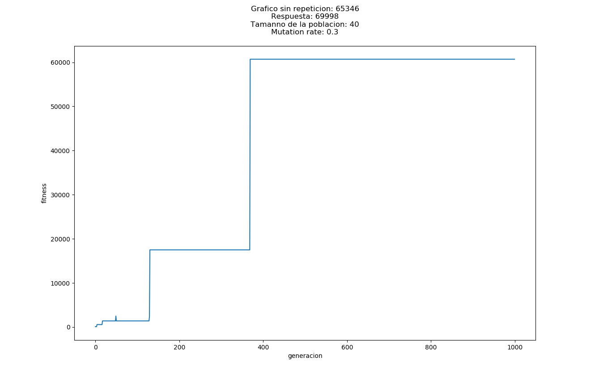

## Instruciones de ejecucion

El desarrollo de la tarea se realizo en intellij con java 11, dado esto, se recomienda el uso de intellij con una version de java 11 o mas.

## Implementacion

La implementacion de la libreria para el arbol esta basada en la implementacion provista en el curso hecha en python, 
con algunas modificaciones para su correcto funcionamiento en java, para manejar las operaciones se usaron funciones lambdas, el algoritmo GP es similar 
al GA hecho en la tarea anterior, la diferencias es que las funciones ahora se manejan como metodos en otra clase, y para su llamado se mantiene una referencia a un objeto de esa clase.

Se creó una clase NodeFactory que permite crear los distintos tipos de nodos internos de acuerdo a un id entero recibido.

## Resultados

### P1
(Archivo P1ConRepeticiones.java, NumRep.java)

Los resultados obtenidos en el primer ejercicio (encontrar numero con repeticiones), generalmente no llegan a una respuesta exacta, 
pero si a unas muy cercanas, esto puede tener varios motivos, error en la implementacion, que la aleatoridad del crossover y posterior mutacion,
no sean capaces generar de mejorar el resultado, osea, entre mas cerca se este de una respuesta correcta, mas improbable se vuelve que se 
obtenga un AST mejor.

Como se puede observar en el grafico, el fitness se mantiene por varias generaciones y luego sube, quizas la implementacion dada no sea
la mejor, dado que alterar un simple nodo en AST, ya sea por crossover o muation, puede alterar en gran medida el resultado final, 
convirtiendo un arbol casi correcto con un buen fitness en uno con uno muy malo, esto genera una mayor aleatoridad que se vuelve imposible de predecir.

#### Mejora de Fitness

Para impedir arboles de un gran tamaño se añadió un metodo countNodes() que retorna la cantidad de Nodos ( internos y externos) que conforman el arbol, dando un mayor fitness 
a aquellos arboles con menor cantidad de nodos.

El grafico muestra como el fitness maximo, se duplica en comparacion al grafico anterior, esto debido a que el tamaño del AST otorga fitness adicional (entre menos tamaño mas fitness).

### P2

(Archivo MainSinReapeat.java, NumSinRep.java)

Para este ejercicio se agrego un nuevo metodo a Node: noReapetTerminals(Set<Integer> term) el cual recorre cada Nodo, y cuando se encuentra con uno terminal verifica 
que el valor no este en el HashSet, agregandolo y retornando true en caso de que no este o retornando false en otro caso. Con esto al calcular el finess de un Node
si este metodo retorna false, el fitness asignado a este nodo se reduce 100 veces, de esta forma se pueden mantener caracterisitcas de arboles que estan cerca de la respuesta
pero repiten terminal. Los resultados obtenidos no fueron muy satisfactorios, obteniendose una disminucion en el fitness maximo alcanzado, 
y la necesidad de mas generaciones para alcanzar un alto fitness.

